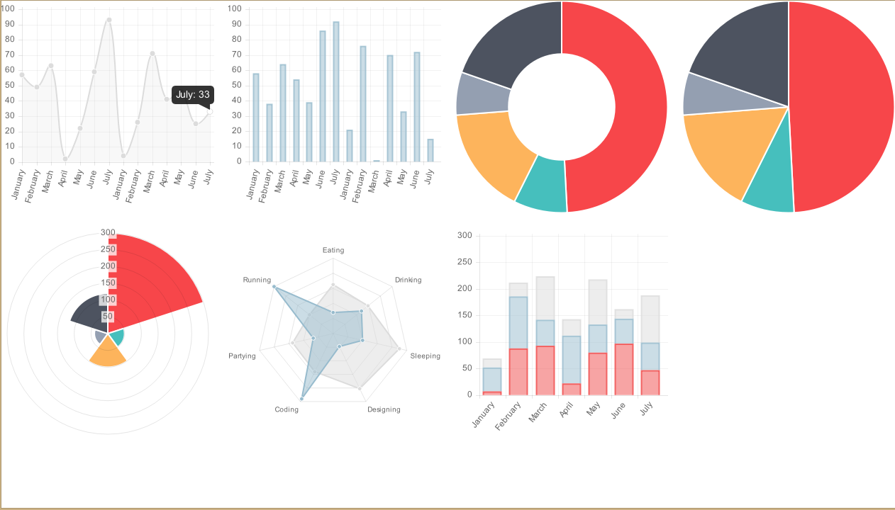

# QMLChartJs
==========

QML Chart module, using chart.js(base on version: "1.0.1-beta.4") to render charts on QML canvas.

This Project borrow ideas from(https://github.com/jwintz/qchart.js)

For a quick check, here is a screenshot:


http://www.chartjs.org uses version 2.0.x at the moment of this writing, so it has many features (and possibly changes) that will not work with this code here.

## Usage
```QML

 QChartJs {
        id: chart_line
        width: 300 
        height: 300 
        chartType: ChartTypes.QChartJSTypes.LINE
        chartData: ChartsData.ChartLineData
        animation: true
        chartAnimationEasing: Easing.InOutElastic;
        chartAnimationDuration: 2000;
    }

```

Check out main.qml for more details.

## Dependencies
Qt >= 5.0

==========
